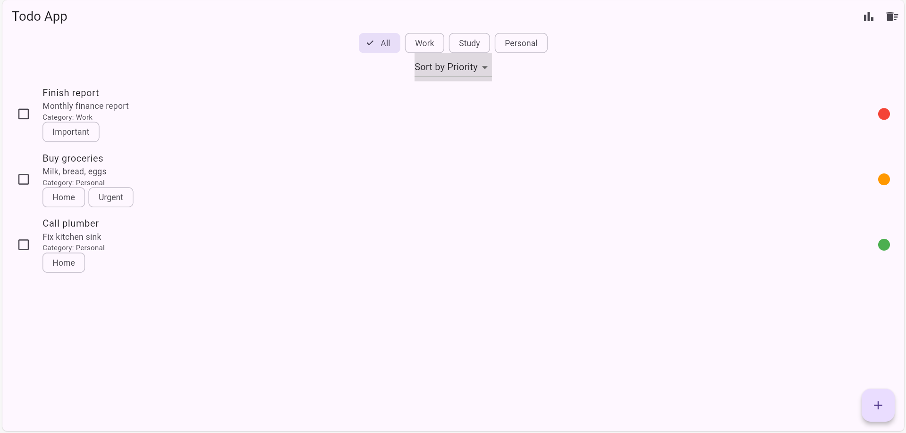
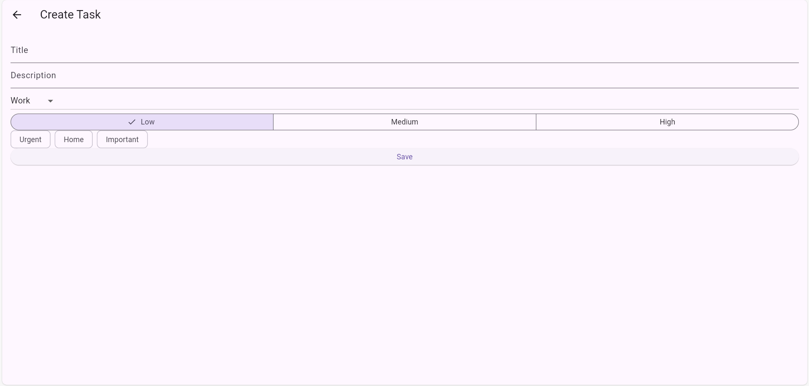
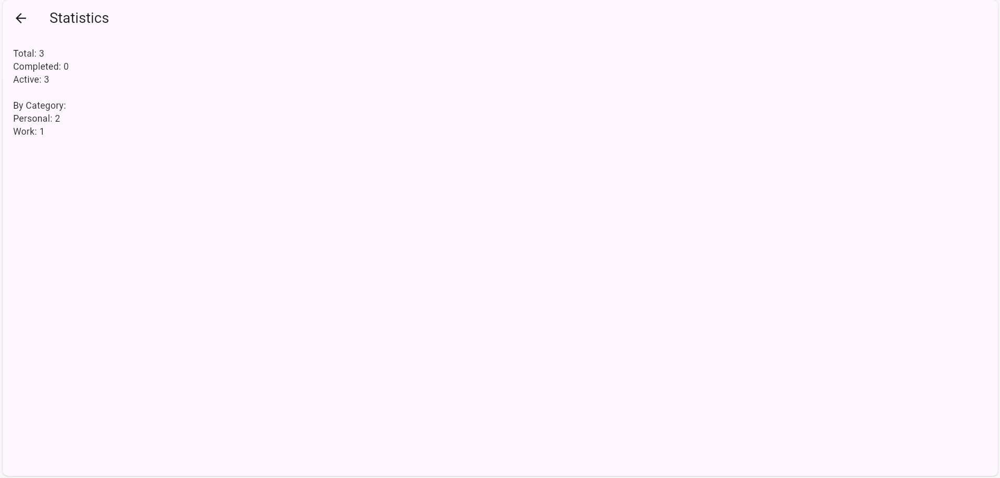

# Todo App (Variant 2)

## Опис
Todo додаток з локальним збереженням через SharedPreferences.
Підтримує категорії, пріоритети, теги та статистику.

## Реалізовані функції
- [x] CRUD операції
- [x] Фільтрація
- [x] Сортування
- [x] Статистика
- [x] Batch delete
- [x] Undo
- [x] Автозбереження

## Технічні деталі
- Flutter
- shared_preferences
- uuid
- Singleton pattern

## Скріншоти
Головний екран застосунку:

Екран додавання задачі

Екран статистики задач

## Відео демонстрація

